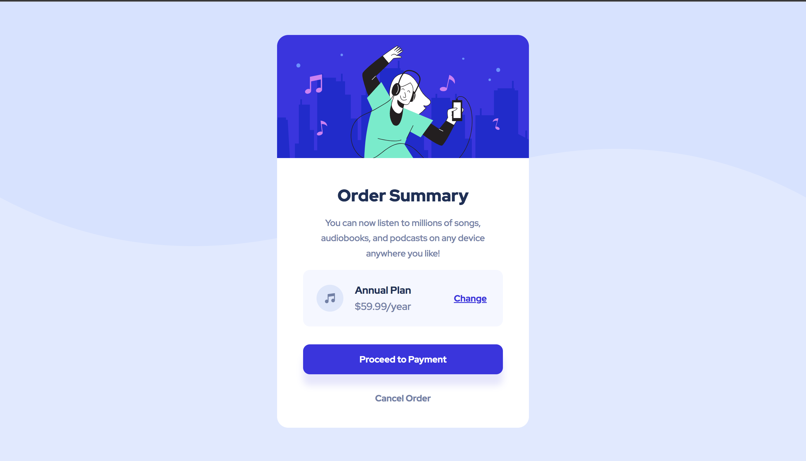

# Frontend Mentor - Order summary card solution

This is a solution to the [Order summary card challenge on Frontend Mentor](https://www.frontendmentor.io/challenges/order-summary-component-QlPmajDUj). Frontend Mentor challenges help you improve your coding skills by building realistic projects.

## Table of contents

- [Overview](#overview)
  - [The challenge](#the-challenge)
  - [Screenshot](#screenshot)
  - [Links](#links)
- [My process](#my-process)
  - [Built with](#built-with)
  - [What I learned](#what-i-learned)
  - [Continued development](#continued-development)
  - [Useful resources](#useful-resources)
- [Author](#author)
- [Acknowledgments](#acknowledgments)

**Note: Delete this note and update the table of contents based on what sections you keep.**

## Overview

### The challenge

Users should be able to:

- See hover states for interactive elements

### Screenshot

### Links

- Solution URL: [Add solution URL here](https://github.com/Maduka-Chisom/Order-summary-component.git)
- Live Site URL: [Add live site URL here](https://maduka-chisom.github.io/Order-summary-component/)

## My process

- Read instructions
- Analyize design, observe document flow and element structure.
- Wrote the html code first
- Then applied styles in css
- Edited the README-template
- create repository and publish code on git
- submit assigment, share project and get feedback

### Built with

- Semantic HTML5 markup
- CSS custom properties
- Flexbox
- CSS Grid

### What I learned

learnt how to center a text, i actually could not for a while it was hilarious but finally figured it out. also learnt how to use the appropriate size for the UI development and i discovered that my browser has been zooming on my page which led to inconsitent sizing but its fixed now.

also i was keen about using semantic html

### Continued development

i intend on building more components, then webpages, websites using html, css and javascript and frontend tools.

### Useful resources

- [resource 1](https://chat.openai.com) - Open Ai helped a lot

## Author

- Website - [Maduka Chisom](https://www.your-site.com)
- Frontend Mentor - [@chisomwest](https://www.frontendmentor.io/profile/chisomwest)
- Twitter - [@ChisomGMaduka](https://twitter.com/ChisomGMaduka)

## Acknowledgments

My heart Tip goes to @grace-snow. in my frontend mentor community she helped me out
